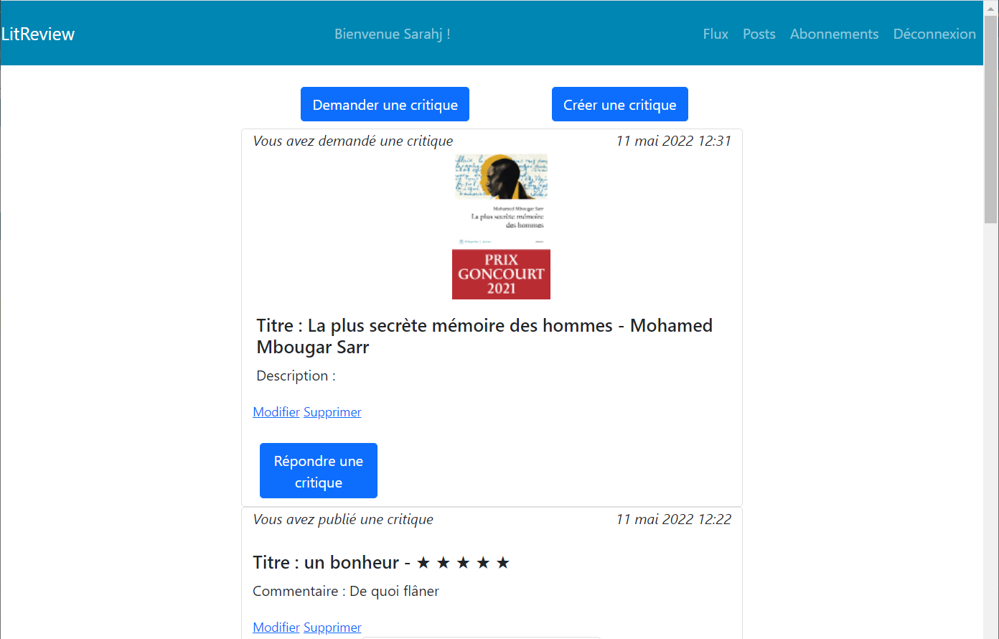

# Projet 09 -  Litreview

## Description

Cette application est un MVP qui permet de : 

- demander des critiques de livres ou d’articles, en créant un ticket ; 
- publier des critiques de livres ou d’articles

Elle présente deux cas d’utilisation principaux : 

- Les personnes qui demandent des critiques sur un livre ou sur un article particulier ;
- Les personnes qui recherchent des articles et des livres intéressants à lire, en se basant sur les critiques des autres.

## Installation

Cette API exécutable localement peut être installée en suivant les étapes décrites ci-dessous. L'usage de pipenv est recommandé, mais des instuctions utilisant venv et pip sont également fournies plus bas. Si pipenv n'est pas encore installé sur votre ordinateur, vous trouverez des instuctions d'installation détaillées [sur cette page](docs/pipenv/installation-fr.md).

### Installation et exécution de l'application avec pipenv

1. Cloner ce dépôt de code à l'aide de la commande `$ git clone clone https://github.com/Aponovi/litreview.git` (vous pouvez également télécharger le code [en temps qu'archive zip](https://github.com/Aponovi/litreview/archive/refs/heads/alter_login.zip))
2. Rendez-vous depuis un terminal à la racine du répertoire litreview avec la commande `$ cd litreview`
3. Installez les dépendances du projet à l'aide de la commande `pipenv install`
5. Démarrer le serveur avec `pipenv run python manage.py runserver`

Les étapes 1 à 4 ne sont requises que pout l'installation initiale.Pour les lancements ultérieurs du serveur, il suffit d'exécuter l'étape 5 à partir du répertoire racine du projet.

### Installation et exécution de l'application sans pipenv (avec venv et pip)

1. Cloner ce dépôt de code à l'aide de la commande `$ git clone clone https://github.com/Aponovi/litreview.git` (vous pouvez également télécharger le code [en temps qu'archive zip](https://github.com/Aponovi/litreview/archive/refs/heads/alter_login.zip))
2. Rendez-vous depuis un terminal à la racine du répertoire litreview avec la commande `$ cd litreview`
3. Créer un environnement virtuel pour le projet avec `$ python -m venv env` sous windows ou `$ python3 -m venv env` sous macos ou linux.
4. Activez l'environnement virtuel avec `$ env\Scripts\activate` sous windows ou `$ source env/bin/activate` sous macos ou linux.
5. Installez les dépendances du projet avec la commande `$ pip install -r requirements.txt`
6. Démarrer le serveur avec `$ python manage.py runserver`

Les étapes 1 à 6 ne sont requises que pout l'installation initiale. Pour les lancements ultérieurs du serveur, il suffit d'exécuter les étapes 4 et 7 à partir du répertoire racine du projet.

## Utilisation

Une fois que vous avez lancé le serveur,  rendez-vous sur un navigateur web à l'adresse http://localhost:8000/

Vous pouvez accéder à  l'interface Admin avec le compte administrateur suivant :\
user : démo22\
mdp : démo22démo22

Les mots de passe des comptes de démonstration ont pour format :\
user : jean8597\
mdp : jean8597jean8597

## Aperçu

